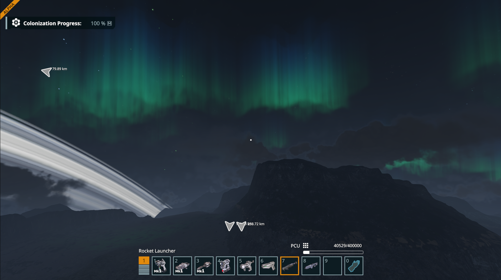

# Aurora Borealis for Space Engineers 2

Aurora Borealis (Northern Lights) over the poles of planets with an atmosphere.

Port of the [Space Engineers 1 plugin](https://github.com/viktor-ferenczi/se-aurora) to Space Engineers 2.

For support please join the Pulsar Discord: https://discord.gg/z8ZczP2YZY

Please consider supporting my work on Patreon: https://www.patreon.com/semods

## Prerequisites

- [Space Engineers 2](https://store.steampowered.com/app/1133870/Space_Engineers_2/)
- [Pulsar](https://github.com/SpaceGT/Pulsar)

## How to use

Enable the Aurora Borealis plugin in Pulsar's Plugins dialog.

## Functionality

Renders volumetric Aurora Borealis (Northern Lights)
over the poles of planets which have an atmosphere.

Open the plugin's Settings for the configuration.

### Original algorithm
- https://blog.roytheunissen.com/2022/09/17/aurora-borealis-a-breakdown/
- https://github.com/RoyTheunissen/Aurora-Borealis-Unity

## How it works

The aurora is a raymarched emissive shell between two altitudes over the magnetic poles,
the same algorithm as the SE1 plugin. The integration with the game is new:

- The pixel shader (`ClientPlugin/Shaders/AuroraBorealis.hlsl`) is compiled by the game's
  own DXC based shader manager. The plugin registers its shader folder as an extra shader
  project, so includes of the game's frame, camera and G-buffer headers resolve to the
  engine's shader tree and the compiled shader lands in the game's shader cache.
- It draws right after the atmosphere pass, into the same additive buffer, so the volume
  rendering composite treats the aurora exactly like the atmosphere glow.
- The renderer already tracks the planets, their atmospheres, the camera and the sun, so
  the effect needs the game thread only for the planet orientation, which decides where
  the poles are.
- The two lookup textures (tileable noise and the vertical color ramp) are baked on the
  GPU by two extra variants of the same shader instead of being uploaded from the CPU.

## Development

- Build with the .NET 10 SDK, Rider or Visual Studio; the solution is `Aurora.sln`.
  The game folder is auto-detected in the default Steam library. If the game is
  elsewhere, run `setup.py` to find it, or set `Game2` in a `Directory.Build.props.user`
  file next to `Directory.Build.props`.
- IDE builds embed the shader into the assembly and extract it on startup. Pulsar builds
  copy the `ClientPlugin/Shaders` asset folder declared in `Aurora.xml` and call
  `LoadAssets` with it instead.
- Access to the renderer internals goes through the Krafs publicizer (IDE builds) and the
  `IgnoresAccessChecksTo` attribute in `ClientPlugin/Tools/GameAssembliesToPublicize.cs`
  (Pulsar builds); keep the two lists in sync.
- To test from source, register the repository as a development folder in Pulsar's
  Sources dialog with `Aurora.xml` as the plugin file (run the `Modern` Pulsar executable
  with `-sources`), then enable the plugin in the plugin list.
- Builds deploy nothing by default. To copy the DLL into `<Pulsar>/Modern/Local` after each
  build, set `Pulsar` in `Directory.Build.props.user` or pass `-p:Pulsar=...`. A deployed
  DLL shows up as a separate local plugin, so prefer the development folder.
